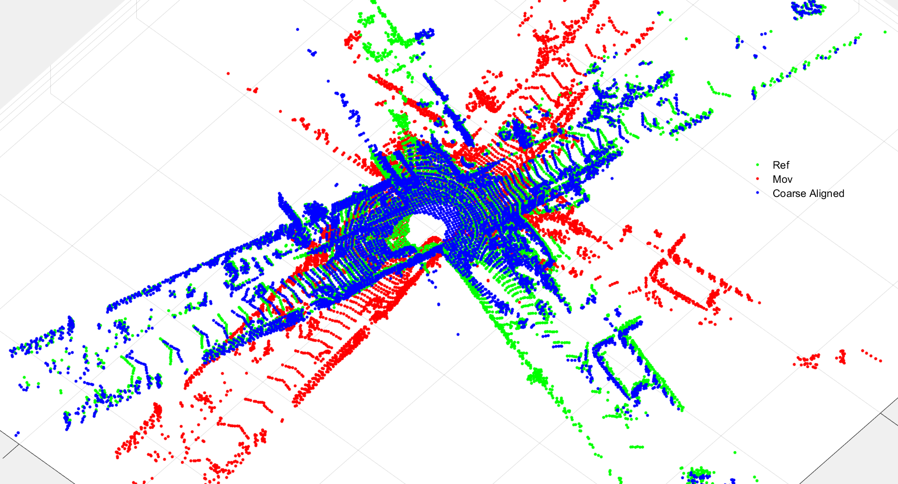

# FPFH_Coarse_Align

Since the widely used point set registration algorithms such as ICP or NDT need a moderate initial transformation guess, the coarse alignment stage is of prime importance for robotics-related applications, especially when no GPS/IMU information are provided. 

The basic idea of coarse alignment is similar to SIFT-based image matching[1]: 1) detect the key points, 2) and compute descriptor vector around each individual key point, and 3) nearest neighbor search to obtain noisy correspondence 3D points pair, and 4) a transformation is attained by RANSAC algorithm. 

In this C++ program, the key points are detected randomly with a spatial resolution of 1.0 meter, and the descriptor vector is computed based on Fast Point Feature Histogram (FPFH)[2], which is proven to be quite accurate even for sparse Velodyne point cloud for autonomous driving.  

To run the program, change the input file names in the reLocalizer.cpp, and the resulting transformation is stored in coarse_results.txt. 

To visualize the results properly, the matlab file Untitled11.m is provided. 

It should be noted that this project is similar with the project of LiDAR/RoPSMatcher, where RoPSMatcher uses RoPS descriptor instead of FPFH descriptor, and the transformation estimators are different. I am not sure which one is better in the general sense, thus both of them are recommanded. 


[1] Holz, Dirk, et al. "Registration with the point cloud library: A modular framework for aligning in 3-D." IEEE Robotics & Automation Magazine 22.4 (2015): 110-124.

[2] Rusu, Radu Bogdan, Nico Blodow, and Michael Beetz. "Fast point feature histograms (FPFH) for 3D registration." Robotics and Automation, 2009. ICRA'09. IEEE International Conference on. IEEE, 2009.

# install

if you use ubuntu, please do
```
git checkout feature/ubuntu
mkdir build && cd build
cmake ..
make -j
./fpfh_coarse_alignment_test
```
# result
	
--------------------------------

If you have any problems, please feel free to contact me.

Di Wang

Laboratory of Visual Cognitive Computing and Intelligent Vehicle

Institute of Artificial Intelligence and Robotics

Xi'an Jiaotong University

Xi'an, Shaanxi, 710049, P.R. China

de2wang@stu.xjtu.edu.cn

280868861@qq.com
